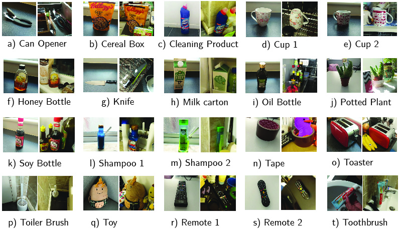

# IROS 2020 - Centroids  Triplet  Network  and Temporally-Consistent  Embeddings  for In-Situ  Object  Recognition.

This website contains the PyTorch implemetation for the Centrois Triplet Network (CTN), as well as the links for downloaded the in-situ househol and CORe50 datasets used on the paper. 

## Requirements

The model was developed in Pytorch 1.5 and uses the Nearest Centroid algorithm implemented in Scikit-Learn 0.23, other requirements are listed in `requirements.txt`. 


## Training the model

To train the model use:

```
python 3 train/train_ctn.py
```

The training script finetunes a ResNet-50 backbone network, pre-trained with ImageNet, and logs the training proccess into a npz file that can be read with `logs\check_logs.py`. 

The script saves the weights of the best performing model.   

## In-situ Households dataset



Our dataset, consisting of the following 20 objects and in-situ training and testing conditions, can can be downloaded from:

[In-Situ Household](https://drive.google.com/file/d/17qKY2QTtrA17jF3jhaL2SKS1ZHuzJcbY/view?usp=sharing)

[Core50](https://drive.google.com/file/d/1Hr9wnV9tYZb6KTfoHWBOasid7fGJB7xw/view?usp=sharing)

If you find our work useful, please cite it as follows:

```
@InProceedings{ctn,
  author        = {Lagunes-Fortiz, Miguel and Damen, Dima and Mayol, Walterio},
  title         = {Centroids Triplet Network and Temporally-Consistent Embeddings for In-Situ Object Recognition},
  booktitle     = {IEEE International Conference on Intelligent Robots and Systems},
  year          = {2020},
}
```

